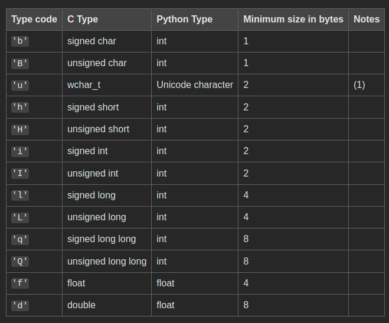

**DataStructres**
-------------
How data is organized, stored, and manipulated within a program.

### Table of contents:
   * 1-Linear Data Structure 
     * Static Data Structure
     * Dynamic Data Structure
   * 2-Non-Linear Data Structure
       
----------------------------------------------------------------------------------------------------------------
# DataTypes
##### The kind of value that tells what operations can be performed on a particular data

# Basic Data Types

  *   ## Numeric Types:
    *    int: Integer values (e.g., 10, -3).
    *    float: Floating-point numbers (e.g., 3.14, -0.001).
    *  complex: Complex numbers (e.g., 1+2j, -3j).
    

  * ## Boolean Type:

    * bool: Represents True or False.

## String Type:

   * str: Sequence of Unicode characters (e.g., "hello", 'python').

# Compound Data Types

* List: Ordered, mutable collection of items (e.g., [1, 2, 3], ['a', 'b', 'c']).
* Tuple: Ordered, immutable collection of items (e.g., (1, 2, 3), ('a', 'b', 'c')).
* Set: Unordered collection of unique items (e.g., {1, 2, 3}, {'a', 'b', 'c'}).
* Dict: Unordered collection of key-value pairs (e.g., {'a': 1, 'b': 2}, {1: 'one', 2: 'two'}).

## Special Data Types
* None: Represents the absence of a value or a null value.

-----------------------------------------------------------------------------------------------------
##### **Everything in python is an object**
##### **Every python object carry(type - refcount - value)**
* # **Objects** 
  * Simple (Numbers - Strings)
    
     * Store thier own value
     * Stored in memory once
       
   * Container (Dicts - Lists - User defined Classes)

# Memory Mangement

 *  **Reference** Count
     *  https://github.com/salma25128/DataStructures/blob/2066b69029353173b6c3ff5cb0fcd9b7f728dbbc/memory_management/ref_count.py#L2

#  Garbage Collection
   
   Automatically release memory when the object takingup that space is no longer in use
# Arrays
Array is not builtin python datastructure but we can implement it by array module     
In Python, WE don’t typically work with arrays, but with lists. 
There are libraries to work with arrays, but you only use them for certain specialized purposes. 
Such as when you need matrix multiplication or some other advanced math, and want to do it quickly.

## Access data by index(Memory):
    array base address+single value stores count * index
    single value stores count = number of array elements
## Arrays Types:
  * Simple Array
  * Two dimensional Array 
  * Multi dimensional Array

## To Deal with Arrays in python:
  *  Import array module
  *  Declare your variable with Typecode //>> variable_name = array(typecode,[elements])
            

----------------------------------------------
**OR Import `numpy`
     It is a Python library that provides a multidimensional array object, various derived objects (such as masked arrays and matrices), 
     and an assortment of routines for fast operations on arrays, including mathematical, logical, 
     shape manipulation, sorting, selecting, I/O, discrete Fourier transforms, basic linear algebra, basic statistical operations, 
     random simulation and much more.**